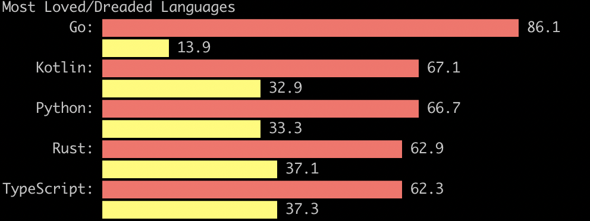
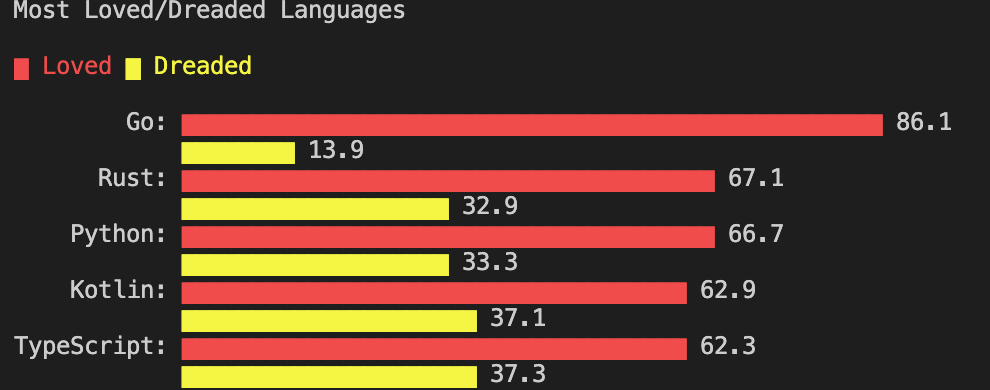
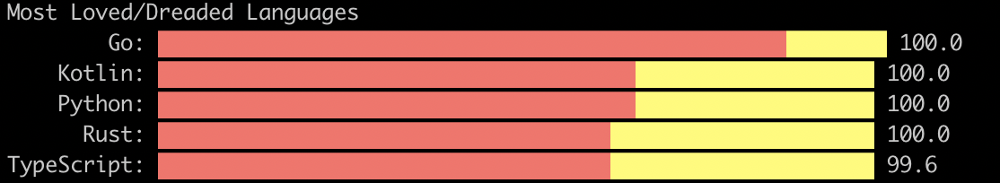

# tgraph tool

A command-line tool which draws basic graphs in the terminal.

## Compile

```
go build -o tgraph
```

## Usage

```sh
tgraph <csv data file>

-title string
    title of graph
-width float
    width of graph in characters default:50 (default 50)
-category string
        categories for different color. example: loved/dreaded
-color string
    support red,blue,green,magenta,yellow,black,cyan
-custom-tick string
    custom tick (default "▇")
-stacked
    stacked bar graph default:false
```

## Examples

```sh
tgraph data2.csv --title "Most Loved Languages"

Most Loved Languages
        Go: ▇▇▇▇▇▇▇▇▇▇▇▇▇▇▇▇▇▇▇▇▇▇▇▇▇▇▇▇▇▇▇▇▇▇▇▇▇▇▇▇▇▇▇▇▇▇▇▇▇▇ 86.1
    Kotlin: ▇▇▇▇▇▇▇▇▇▇▇▇▇▇▇▇▇▇▇▇▇▇▇▇▇▇▇▇▇▇▇▇▇▇▇▇▇▇ 67.1
    Python: ▇▇▇▇▇▇▇▇▇▇▇▇▇▇▇▇▇▇▇▇▇▇▇▇▇▇▇▇▇▇▇▇▇▇▇▇▇▇ 66.7
      Rust: ▇▇▇▇▇▇▇▇▇▇▇▇▇▇▇▇▇▇▇▇▇▇▇▇▇▇▇▇▇▇▇▇▇▇▇▇ 62.9
TypeScript: ▇▇▇▇▇▇▇▇▇▇▇▇▇▇▇▇▇▇▇▇▇▇▇▇▇▇▇▇▇▇▇▇▇▇▇▇ 62.3
```

An example using emoji:

```sh
tgraph data2.csv --title "Most Loved Languages" --custom-tick 🔥 --width 30

Most Loved Languages
        Go: 🔥🔥🔥🔥🔥🔥🔥🔥🔥🔥🔥🔥🔥🔥🔥🔥🔥🔥🔥🔥🔥🔥🔥🔥🔥🔥🔥🔥🔥🔥 86.1
    Kotlin: 🔥🔥🔥🔥🔥🔥🔥🔥🔥🔥🔥🔥🔥🔥🔥🔥🔥🔥🔥🔥🔥🔥🔥 67.1
    Python: 🔥🔥🔥🔥🔥🔥🔥🔥🔥🔥🔥🔥🔥🔥🔥🔥🔥🔥🔥🔥🔥🔥🔥 66.7
      Rust: 🔥🔥🔥🔥🔥🔥🔥🔥🔥🔥🔥🔥🔥🔥🔥🔥🔥🔥🔥🔥🔥 62.9
TypeScript: 🔥🔥🔥🔥🔥🔥🔥🔥🔥🔥🔥🔥🔥🔥🔥🔥🔥🔥🔥🔥🔥 62.3
```

An example with colors:

```sh
tgraph data1.csv --title "Most Loved/Dreaded Languages" --color red,yellow
```



An example with categories

```sh
tgraph data1.csv --title "Most Loved/Dreaded Languages" --category Loved,Dreaded --color red,yellow
```



An example with stacked:

```sh
tgraph data1.csv --title "Most Loved/Dreaded Languages" --color red,yellow --stacked
```


